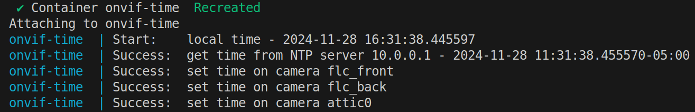

# ONVIF Time

Simple service to periodically synchronize the time of ONVIF compatible cameras with arbitrary NTP servers.



## Motivation
Security cameras periodically synchronize their time with an NTP server, in order to always have an accurate time stamp in the recording.

If the camera is connected to a network without internet access, and if the NTP server used by the camera is hardcoded, the camera will fail to synchronize and its internal time will (not so) slowly drift away.

If the camera supports the ONVIF protocol, it could be possible to set the camera time through it.

This simple service does just that: it periodically gets the current time from a user provided NTP server, and then applies it to a list of user provided ONVIF compatible cameras.

The end result is that your cameras will always have accurate time, while still being completely prevented from accessing the internet.

## Configuration
Below is an example configuration file:
```json
{
  "ntp": {
    "host": "pool.ntp.org",
    "port": 123,
    "timeout": 5
  },
  "cameras": {
    "front_camera": {
      "host": "10.0.0.2",
      "port": 12345,
      "user": "user",
      "password": "password"
    },
    "back_camera": {
      "host": "10.0.0.3",
      "port": 12345,
      "user": "user",
      "password": "password"
    }
  }
}
```

## Running
### Docker Run
```bash
docker run --rm \
  -v /path/to/config.json:/config/config.json \
  -e TZ="America/New_York" \
  -e ONVIF_TIME_SCHEDULE="0 2 * * *" \
  ghcr.io/alesgenova/onvif-time:dev
```

### Docker Compose
```yaml
services:
  onvif-time:
    image: ghcr.io/alesgenova/onvif-time:dev
    volumes:
      - /path/to/config.json:/config/config.json
    environment:
      TZ: "America/New_York"
      ONVIF_TIME_SCHEDULE: "0 2 * * *"
      ONVIF_TIME_STARTUP_SYNC: True
    restart: unless-stopped
```

### Run once
To synchronize the time once and quit, run the container as follows:
```bash
docker run --rm \
    -v /path/to/config.json:/config/config.json \
    -e TZ="America/New_York" \
    ghcr.io/alesgenova/onvif-time:dev python3 /src/onvif_time.py
```

## Environment Variables
### `TZ`
Set the `TZ` variable to change the local time zone.

Default value is `"UTC"`

### `ONVIF_TIME_SCHEDULE`
The script is run as a cron job. Set the `ONVIF_TIME_SCHEDULE` variable to tweak how often the time will be synchronized.

Default value is `"0  2  *  *  *"` (i.e. every day at 2 AM).

### `ONVIF_TIME_STARTUP_SYNC`
Set the `ONVIF_TIME_STARTUP_SYNC` variable `True` to also synchronize the time when the container first starts.

Default value is `True`.

### `ONVIF_TIME_DRY_RUN`
Set the `ONVIF_TIME_DRY_RUN` variable `True` to skip actually setting the time on the camera. Can be useful when testing the configuration.

Default value is `False`.
